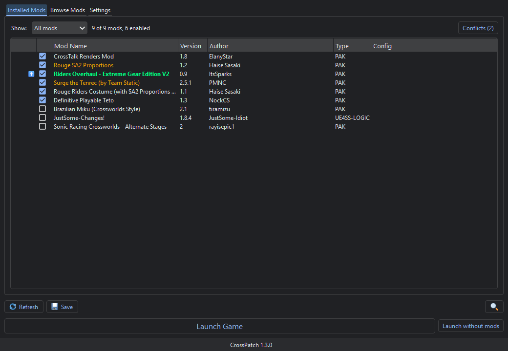
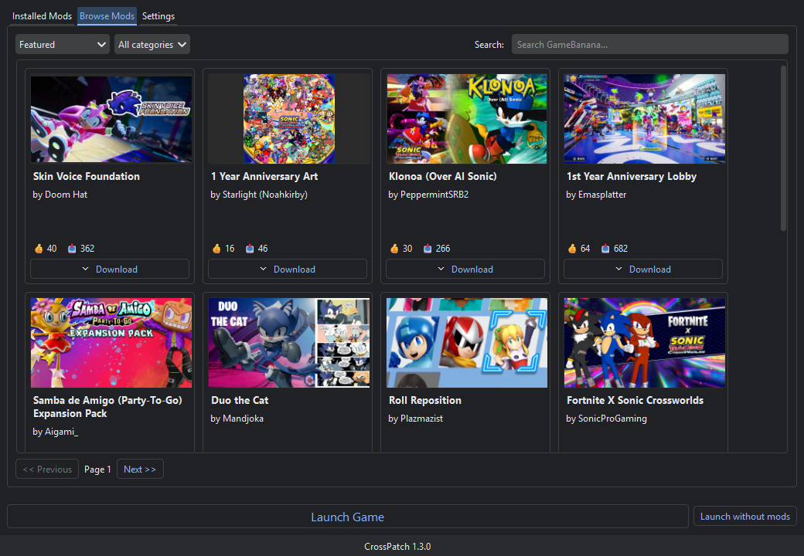
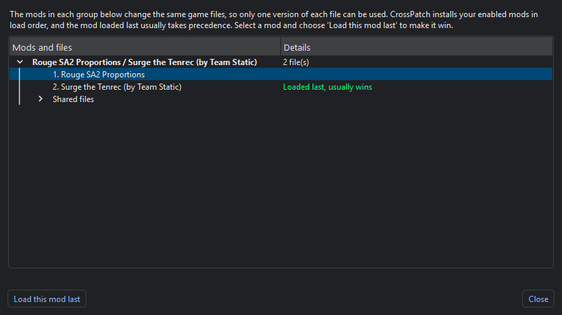

<div align="center">


# CrossPatch

**A mod manager for Sonic Racing: CrossWorlds. Browse GameBanana, install in one click, and keep your load order under control.**

[](https://github.com/Robocnop/CrossPatch/releases/latest)
[](https://github.com/Robocnop/CrossPatch/actions/workflows/ci.yml)
[](LICENSE)


[**Download**](https://github.com/Robocnop/CrossPatch/releases/latest) ·
[Features](#features) ·
[How it works](#how-it-works) ·
[Troubleshooting](#troubleshooting) ·
[Building from source](#building-from-source)

</div>

---

CrossPatch keeps your mods in their own folder, outside the game, and copies the ones you enable into
*Sonic Racing: CrossWorlds* in the order you choose. It finds the game on its own, installs mods straight
from GameBanana (including the **1-Click Install** button), tells you when two mods fight over the same game
files, and lets you switch between whole mod setups with profiles you can share as a file.

It handles both **pak mods** and **UE4SS** script and logic mods, and speaks **English and French**.

> Unofficial project, not affiliated with SEGA, Sonic Team or GameBanana. Every mod belongs to its author, who
> is credited on its GameBanana page. This is a maintained fork of
> [NickPlayzGITHUB/CrossPatch](https://github.com/NickPlayzGITHUB/CrossPatch).





## Quick start

1. Download **`CrossPatch-<version>-win-x64-setup.exe`** from the
   [latest release](https://github.com/Robocnop/CrossPatch/releases/latest) and run it. The installer is not
   code-signed, so Windows SmartScreen may warn about it: click *More info*, then *Run anyway*.
2. Start CrossPatch. It finds the game through Steam, and the welcome screen checks your setup.
3. Find mods in **Browse Mods**, or click **1-Click Install** on any GameBanana page.
4. Tick the mods you want, drag them into the order you like, then click **Save**.
5. Click **Launch Game**.

No administrator rights, no Python and no .NET runtime are needed: everything ships with the app, and the
installer installs for the current user by default.

On Linux or the Steam Deck (desktop mode), see [Download options](#download-options).

## Features

### Your mods

- **Automatic game detection** through Steam, across every Steam library.
- **Pak and UE4SS mods**. UE4SS itself is offered for download the first time you enable a mod that needs it.
- **Load order by drag and drop**, applied to the game when you save.
- **Filters** (enabled, disabled, update available, in conflict, pak, UE4SS) and a search bar (`Ctrl+F`).
- **Mod options**: mods that ship several variants get a configuration dialog, per profile.
- **Drop a `.zip`, `.7z` or `.rar`** onto the list to install a mod you downloaded yourself.
- **Launch without mods**: removes what CrossPatch installed into the game and starts it unmodded, for a quick
  comparison. Your mods and profiles are kept; *Save* puts everything back.

### GameBanana

- **Browse** featured, newest, recently updated, most liked, most downloaded or most viewed mods, filter by
  category, and search by name. Mods you already have are marked **Installed**.
- **1-Click Install** from the GameBanana website opens straight in CrossPatch.
- **Update checks** for every mod installed from GameBanana, with **Update all** to get them in one go. The
  right archive is picked automatically when a mod offers several; you are asked only when it is ambiguous.
- Mod name, author and version come from GameBanana and can be edited per mod.

### Conflicts

- Every pak is analysed to list the game files it replaces, so CrossPatch knows when **two enabled mods change
  the same files**.
- Conflicting mods are highlighted, and the **Conflicts** window groups them by shared files, shows which one
  loads last, and moves the mod you want to win with one click.
- Conflicts you do not care about can be ignored.

### Profiles

- Keep several mod setups side by side and switch between them from *Settings*.
- **Share a profile** as a small `.crosspatch` file. It lists mods by their GameBanana page and never contains
  mod files. Importing it downloads whatever is missing and recognises the mods you already have, whatever you
  named their folder.

### Safe by design

- **Verified updates**: CrossPatch checks GitHub at startup, and every update is compared with the SHA-256
  checksum GitHub publishes for the release before it is installed.
- **Settings backups**: back up and restore your settings and profiles in one click. A backup is also made
  automatically before every update and every restore.
- **1-Click links are validated**: CrossPatch only downloads from GameBanana, whatever a link says.
- **Diagnostic log**, one click away in *Settings*, to attach to bug reports.
- Settings are written atomically, so a crash can never leave a half-written config behind.

### App

- **Interface size** setting, set to 150 % automatically on the Steam Deck.
- **Single instance**: a 1-Click link opened while CrossPatch runs goes to the open window.
- **English and French**, following your system language. Other languages can be added without rebuilding,
  see [Languages](#languages).



## How it works

CrossPatch never edits the game's own files. Your mods live in a folder of their own, and the enabled ones are
copied into the game when you save:

| Location | Used for |
|---|---|
| Your mods folder (default `%APPDATA%\CrossPatch\mods`) | Every mod you installed, enabled or not, each with an `info.json` |
| `<game>\UNION\Content\Paks\~mods\` | Enabled pak mods, as `000.ModName`, `001.ModName`... in load order |
| `<game>\UNION\Binaries\Win64\ue4ss\Mods\` | Enabled UE4SS script mods |
| `<game>\UNION\Content\Paks\LogicMods\` | Enabled UE4SS logic mods |

Only the folders CrossPatch created are ever removed from the game, so anything you placed there by hand stays.

CrossPatch's own data:

| | Windows | Linux |
|---|---|---|
| Settings, profiles, backups | `%APPDATA%\CrossPatch\` | `~/.config/CrossPatch/` |
| Logs (last 3 sessions) | `%APPDATA%\CrossPatch\logs\` | `~/.config/CrossPatch/logs/` |
| Your own translations | `%APPDATA%\CrossPatch\locales\` | `~/.config/CrossPatch/locales/` |

Set `CROSSPATCH_PORTABLE=1` to keep all of it next to the executable instead.

### Mod metadata

Mods installed from GameBanana get their `info.json` automatically. For a mod you made or installed by hand,
create one in its folder (every field is optional):

```json
{
  "name": "My Mod",
  "version": "1.0",
  "author": "Your Name",
  "mod_page": "https://gamebanana.com/mods/12345",
  "mod_type": "pak"
}
```

`mod_type` is `pak` (default), `ue4ss-script` or `ue4ss-logic`. With a `mod_page`, CrossPatch checks the mod for
updates.

## Download options

| File | For |
|---|---|
| `CrossPatch-<version>-win-x64-setup.exe` | **Windows 10/11, recommended** |
| `CrossPatch.<version>.zip` | Windows, portable (no installation) |
| `CrossPatch-<version>-linux-x64.zip` | Linux x64 and Steam Deck desktop mode |

- The **installer** adds a Start menu entry (and an optional desktop shortcut), registers GameBanana's
  1-Click links and appears in *Settings > Apps*. It installs for the current user by default, or for all users
  if you choose so. Updates install over the existing copy; uninstalling asks before deleting your settings
  and mods.
- The **portable** zip runs from any folder. Extract it and start `CrossPatch.exe`; it updates itself in place.
- **Linux / Steam Deck**: extract the archive, then run `./run.sh`. Run `./install.sh` once to get a menu entry
  and make 1-Click links open CrossPatch. The build targets glibc 2.31 (Ubuntu 20.04, Debian 11, SteamOS 3
  and newer). `.rar` archives need the system `unrar` package. See `README-LINUX.md` in the archive.

## Troubleshooting

**Windows SmartScreen warns about the installer.**
The executable is not code-signed. Click *More info*, then *Run anyway*.

**My mods do not show up in the game.**
Make sure they are ticked and that you clicked **Save** after changing anything. Check the game folder in
*Settings*: it is the one that contains a `UNION` folder.

**Two mods change the same thing and the wrong one wins.**
Open **Conflicts** on the *Installed Mods* tab, select the mod that should win and click *Load this mod last*,
then save.

**GameBanana's 1-Click Install does nothing.**
Start CrossPatch once, which registers the link handler, then try again. On Linux, run `./install.sh`.

**Conflict detection says the pak analyser is unavailable.**
The analyser ships with every release. From a source checkout it is found under `tools/CrossPatchParser/`.

**I want the unmodded game back.**
Click **Launch without mods**, or untick everything and save.

**Something else went wrong.**
Open *Settings > Open logs folder* and attach `crosspatch.log` (or `crosspatch.1.log` if you restarted since) to a
[new issue](https://github.com/Robocnop/CrossPatch/issues).

## Languages

CrossPatch ships in **English** and **French** and follows your system language; you can force one under
*Settings > Language*.

To add a language, copy `assets/locales/en.json`, rename it after the language code (`de.json`, `es.json`,
`pt_BR.json`...), translate the values and set `_meta.name` to the language's own name. Drop it in the
*translations* folder listed [above](#how-it-works) and restart: it appears in the list, survives updates, and
any key you leave out falls back to English. Pull requests adding a language are welcome.

## Building from source

Requirements: Python 3.12 or newer. For release builds, also
[Inno Setup 6](https://jrsoftware.org/isinfo.php) (`winget install JRSoftware.InnoSetup`) and, only to rebuild
the pak analyser, the [.NET 8 SDK](https://dotnet.microsoft.com/download).

```bash
pip install -r requirements-dev.txt
python src/Main.py
python -m pytest
```

Set `CROSSPATCH_PORTABLE=1` to try the app without touching your real settings.

Release builds:

```powershell
./packaging/windows/build.ps1                  # tests, portable zip and installer in dist/
./packaging/windows/build.ps1 -SkipInstaller   # without Inno Setup
./packaging/windows/build.ps1 -RebuildParser   # republish the pak analyser first
```

```bash
python packaging/stage_linux_ctx.py            # Linux: stage the Docker context...
docker build --target export --output "type=local,dest=dist" build/ctx   # ...and build the zip
```

### Releasing

1. Bump the version in both `version.txt` and `src/Constants.py`.
2. Build both platforms, then publish a GitHub release tagged `v<version>` with the installer, the portable zip
   and the Linux zip. GitHub records a SHA-256 digest for every file, which the in-app updater checks.

Installed copies update from the installer; portable copies and older versions update from the zips, so keep
publishing all three.

### Project layout

```
src/                     the application (PySide6)
  Main.py                entry point: single instance, logging, startup checks
  CrossPatch.py          main window
  ModList.py             mod list logic: filters, conflicts, load order (no widgets, tested)
  Util.py                GameBanana API, archives, installing mods into the game
  DownloadManager.py     downloads and extraction
  ProfileSharing.py      .crosspatch profile files
  Updater.py             self update, checksum verification
  Backup.py, Logs.py     settings backups, session log
assets/locales/          translations
tools/CrossPatchParser/  pak analyser (C#, CUE4Parse)
tests/                   pytest suite, run on Windows and Linux by the CI
packaging/windows/       PyInstaller spec, Inno Setup script, build.ps1
packaging/linux/         Dockerfile, PyInstaller spec, run/install scripts
```

More in [CONTRIBUTING.md](CONTRIBUTING.md).

## Known limitations

- **Which mod wins a conflict** follows the load order Unreal uses for `~mods`. CrossPatch marks the mod loaded
  last as the one that *usually* wins; check in game when it matters.
- **Not code-signed**, so SmartScreen warns on first launch.
- **Linux** is tested less than Windows, and there is no controller-friendly interface for Game Mode yet.
- Mods installed by hand have no GameBanana page, so they get no update checks and cannot be downloaded by
  someone importing your profile.

## Contributing

Bug reports, translations and pull requests are welcome. See [CONTRIBUTING.md](CONTRIBUTING.md) for the setup,
the project rules and how to report a bug with the log.

## Privacy

CrossPatch collects nothing. It only talks to GameBanana (mods) and GitHub (updates). See
[PRIVACY.md](PRIVACY.md).

## License

[GPL-3.0](LICENSE). Mods remain the property of their authors.

## Credits

- Original CrossPatch by [NockCS](https://github.com/NickPlayzGITHUB), with [RED1](https://github.com/Red1Fouad),
  [AntiApple4life](https://github.com/AntiApple4life) and [Ben Thalmann](https://github.com/btdotdev).
- Mods, pages and the 1-Click Install protocol: [GameBanana](https://gamebanana.com/) and its creators.
- Built with [PySide6](https://doc.qt.io/qtforpython/), [PyQtDarkTheme](https://github.com/5yutan5/PyQtDarkTheme),
  [py7zr](https://github.com/miurahr/py7zr), [rarfile](https://github.com/markokr/rarfile) and
  [CUE4Parse](https://github.com/FabianFG/CUE4Parse); UE4SS mods run on [UE4SS](https://github.com/UE4SS-RE/RE-UE4SS).
